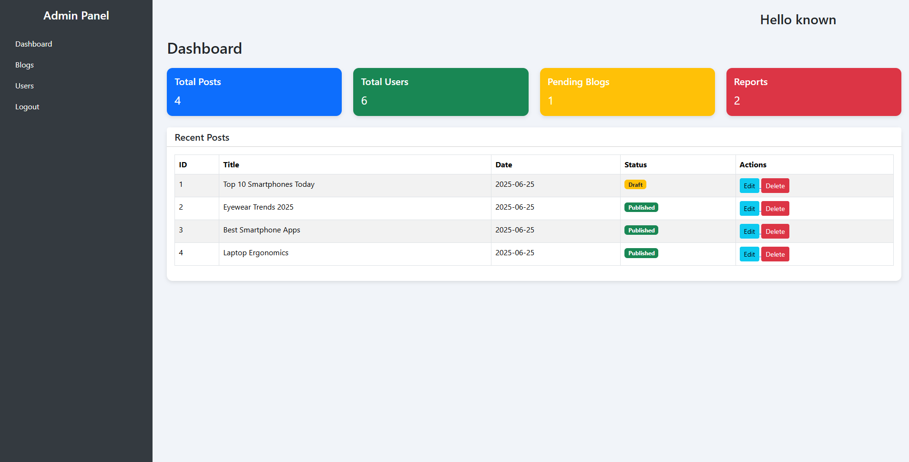

<!-- ──────────────────────────────────────────────────────────────── -->
<!--  BlogApp – README.md                                            -->
<!-- ──────────────────────────────────────────────────────────────── -->

<h1 align="center">
  BlogApp 📝
</h1>

<p align="center">
  <a href="https://github.com/vishalg0419/blog_app/stargazers"></a>
  <a href="https://github.com/vishalg0419/blog_app"></a>
  
  
</p>

> **BlogApp** is a lightweight PHP & MySQL blogging platform where users can **register, login, write, edit, delete, publish or draft posts**, and explore everyone else’s content in a clean Bootstrap interface.  
> Built a Basic full-stack learning project, it focuses on fundamental CRUD operations, image uploads, session-based auth, and responsive UI.

---

## ✨ Features

| Module            | Highlights                                                                      |
| ----------------- | ------------------------------------------------------------------------------- |
| User Auth         | Register / login / logout with session handling                                 |
| Blog CRUD         | Create, **draft**, publish, edit, delete                                        |
| Image Upload      | Per-post featured image (stored in `/uploads`)                                  |
| Admin Sidebar     | Quick links to dashboard, posts, users, logout                                  |
| Responsive Layout | 3-column cards on desktop, 2 on tablets, 1 on mobile                            |
| Category Tags     | Simple dropdown on post form helps filter content                               |
| Rich Post View    | Nice reading page with meta info, hero image and Markdown-friendly content area |
| Clean Codebase    | <200 lines per file, no heavy frameworks—easy to read & extend                  |

---

## 📸 Screenshots

| Dashboard                                  |
| ------------------------------------------ |
|  |

<sub>This is DashBoard Page. You Can refer images folder for more details</sub>

---

## 🏗️ Tech Stack

| Layer      | Tech                                                   |
| ---------- | ------------------------------------------------------ |
| Front-end  | HTML5 • CSS3 • **Bootstrap 5.3** • Vanilla JS          |
| Back-end   | PHP (procedural style)                                 |
| Database   | **MySQL** / MariaDB                                    |
| Auth       | PHP Sessions                                           |
| Deployment | Works on any LAMP / XAMPP stack (Apache + MySQL + PHP) |

---

## 🚀 Getting Started

### 1. Clone & install

```bash
git clone https://github.com/vishalg0419/blog_app.git
cd blog_app

```
